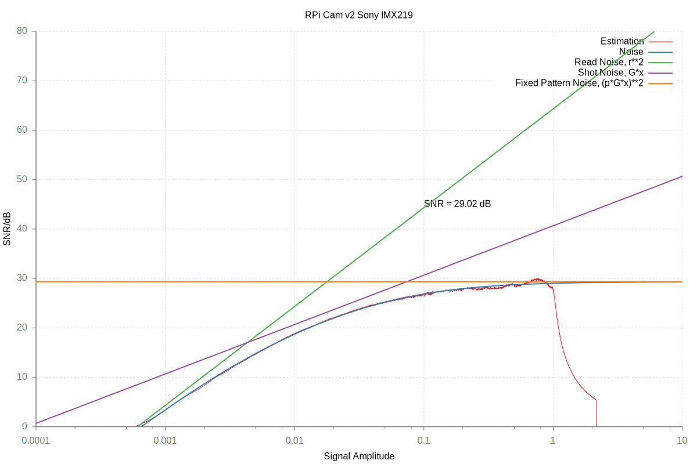

hdr-srn
=======

#### Create an HDR image out of an exposure series and estimate the SNR of the sensor. ####

The initial goal was to create an HDR image out of an exposure series. This lead to the idea of estimating the SNR of the sensor out of the exposure series. Which turned out to be possible with surprisingly low effort without requiring special equipment. The only requirement is an exposure series taken from a static scene using know exposure paramenters. Especially I have not found any resource documenting the approach proposed. This is why I decided to share the approach with you.

<http:DxOMark.com> is a widely known resource for obtaining sensor characteristics of image sensor. A great resource for the characteristics of images sensors is <http:sensorgen.info>. However, both of them focus almost exclusively on high-level DSLR cameras. Finding similar figures for the Sony IMX219 is hopeless.

# RAW Format

To obtain an HDR image out of an exposure series first the colors need to be transformed to a linear scale. This step depends on the encoding of the image.

For the Raspberry Pi v2 camera using the Sony IMX219 sensor the RAW format is 10 bit linear encoded having values \[0,1024). Black is not 0 but 64. There are two more tricky points:

1.  I found the exposure time reported is off by 16 &micro;s.
2.  Very dark pixles do not have a high signal to noise ratio, therefore, I filtered out values below 2 to reduce clutter. Pixels encoded as 1023 are potentially overexposed, these I filtered out as well.

Taking these points into account the histograms of the different exposures align pretty well, see Figure below. I highlighted the histogram of one of the images as a bold black line without filtering out any values. On the right one can see the overexposed pixel count sums up to a value outside the diagram. The sum of the underexposed pixels cannot be read from the diagram since we have a logarithmic scale on the x-axis.

See <https://github.com/Harry79/raspberrypi-openmax-exposure-series> for capturing an exposure series on the Raspberry Pi.

# Obtaining the HDR image

Creating the HDR image is now just a matter of averaging the pixel values from the input images taking into account their SNR. The SNR can first be assumed to be just affected by quantization noise, which is constant for the linear encoding presented above. The result is an HDR image which can be improved by using a better SNR.

# Deriving the SNR

The noise is calculated based on the assumption the obtained HDR image is the ground truth signal. This assumption is obviously violated for at least two reasons: The number of input images is limited the SNR used to average the input images is not exactly estimated.

Sensorgen presents how they extract a noise model using three parameters: read noise, saturation capacity, and quantum efficiency from the SNR of the sensor <http://sensorgen.info/Calculations.html>. This was the basis for the derivation presented here.

This Figure shows the SNR based on the noise and the fitted model.

# Improving the estimates

Using the SNR model we just obtained we redo the HDR image creation and the SNR estimation. After some iterations we obtain a reasonable estimate of the SNR: \(G = 10771.7\), \(r=5.74783\), \(p=0.0345259\).

